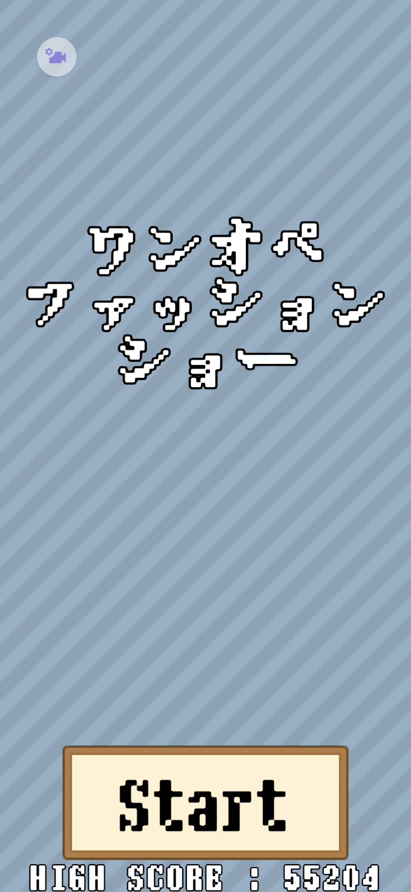
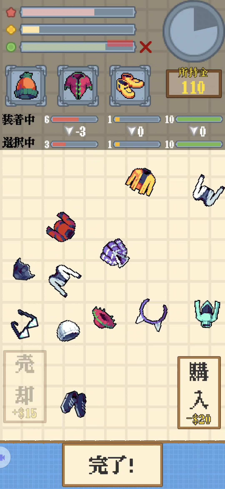
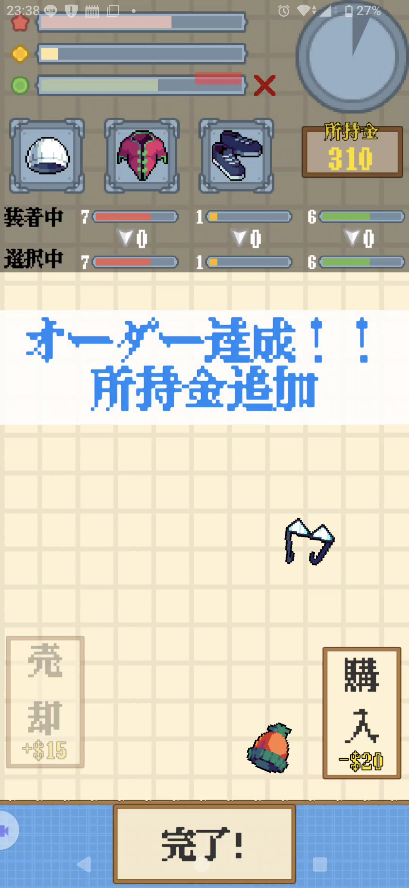
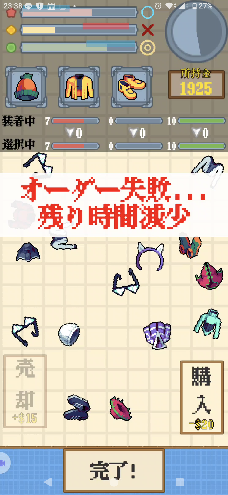
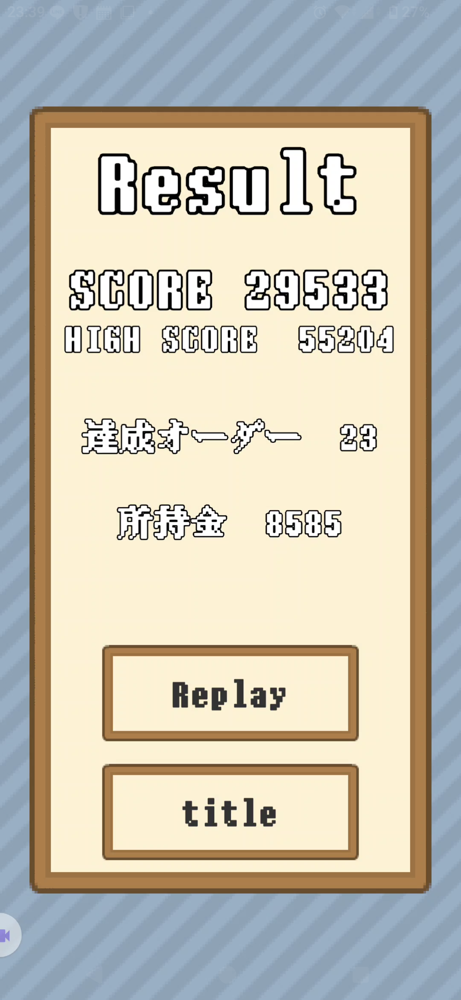

# ワンオペファッションショー
限られた時間内でオーダーを満たした服の組み合わせを作って提出し、高得点を目指すゲームです。

## プレイ動画
https://youtube.com/shorts/9SoxyhsJHBI

## スクリーンショット

### タイトル画面

  

### プレイ画面

  
  
  

### リザルト画面

  

## 実行方法

## 使用技術
- Unity 6
- C#

## 制作形態
株式会社サイバーエージェントのゲーム開発インターンシップにて、3人チームで制作しました。

1週間の事前準備期間で企画・設計・素材選定を行い、その後2日間でゲームを完成させました。

### 担当箇所
- シーン遷移処理と遷移時の演出
- タイトル画面・リザルト画面
- BGM・SEの処理
- インゲーム開始・終了時の演出

## ゲーム概要

帽子・服・靴を組み合わせて、指定されたオーダーを達成していくゲームです。

各装備には3種類のステータスが設定されており、装備した帽子・服・靴のステータス合計値がオーダーの条件を満たすようにコーディネートを作成します。完成したコーディネートを提出すると、達成したオーダーに応じてスコアとお金を獲得できます。

条件を満たせる装備が手元にない場合は、所持金を消費して新しい装備を購入できます。購入時には、部位やステータスがランダムに決定されます。

制限時間内に「コーディネート作成 → 提出 → 装備購入」を繰り返し、最終的なハイスコアを目指します。

## 操作方法

- **アイテムをタップ**

  選択したアイテムに装備を変更した場合の、ステータスの変化量を表示します。

- **アイテムをダブルタップ**

  選択したアイテムを装備します。

- **アイテムをドラッグ＆ドロップ**

  売却ゾーンにドロップすることで、装備を売却できます。

## 工夫した点
開発期間が2日間と限られていたため、準備期間中に実装する機能を洗い出して優先順位を設定し、「ゲームとして最低限成立するライン」を事前に決めました。

### 最低限の完成ライン
- 「タイトル画面 → インゲーム画面 → リザルト画面 → タイトル画面」のゲームループ
- オーダーの生成と提出時点でのオーダー達成の判定
- アイテムの購入・売却
- ハイスコアの保存・表示
- BGMの実装

### 追加で実装できた内容
最低限の機能を完成させた後、残り時間に応じて以下の要素を追加しました。

- タイトル画面やアイテム購入・売却時、オーダーの達成時の演出・SE
- シーン遷移やゲーム開始・終了時の演出
- チュートリアルの表示

## 反省点
開発チーム以外の人にプレイしてもらう時間を十分に確保できず、ゲームシステムの分かりにくさや、チュートリアルの説明不足に開発中に気づくことができませんでした。

また、開発終盤は完成を優先して実装を進めたため、一部のコードで責務の分離や再利用性を十分に考慮できませんでした。今後同様の短期開発を行う場合は、最低限の完成後にプレイテストとリファクタリングの時間を確保することまで含めて、事前にスケジュールを設計したいと考えています。

## ソースコード
自分が担当した箇所のソースコードは、`ここにリンク`からご覧いただけます。